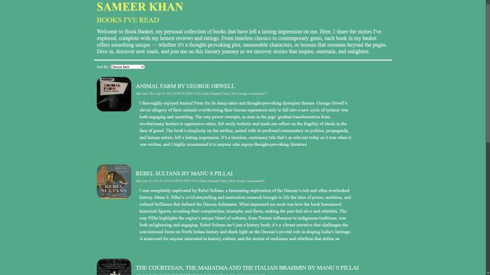

# Book Basket

> A full-stack book discovery platform for sharing books, ratings, and reviews while helping readers discover their next great read.

<p align="center">
  
</p>

---

## 🏛️ Overview

Book Basket is a full-stack web application built using the **PERN stack (PostgreSQL, Express.js, React, and Node.js)**. It enables users to explore a curated collection of books through detailed ratings, reviews, and automatically fetched book covers.

By integrating external book APIs, the platform enriches each listing with visual representations, creating a more engaging browsing experience while encouraging users to discover highly recommended books across different genres.

---

## ✨ Highlights

- 📚 Browse a curated collection of books
- ⭐ Read ratings and detailed reviews
- 📝 Add books with personal reviews
- 🖼️ Automatic book cover retrieval using external APIs
- 🔍 Discover new books through community recommendations
- 🎨 Clean and intuitive user interface
- 📱 Fully responsive design
- ⚡ Fast PERN stack architecture

---

## 🚀 Tech Stack

| Category | Technologies |
|----------|--------------|
| Frontend | React |
| Backend | Node.js, Express.js |
| Database | PostgreSQL |
| Styling | Bootstrap 5, CSS3 |
| API Integration | Book Cover APIs |
| Language | JavaScript (ES6+) |

---

## 📂 Project Structure

```text
Book Basket
├── client
│   ├── public
│   └── src
├── server
│   ├── routes
│   ├── controllers
│   ├── models
│   └── config
├── package.json
└── README.md
```

---

## ⚡ Getting Started

### Clone the repository

```bash
git clone https://github.com/sameer-khan-a/Book-Basket.git
```

### Navigate into the project

```bash
cd Book-Basket
```

### Install dependencies

```bash
npm install
```

### Start the development server

```bash
npm run server
```

---

## 📸 Website Snapshots

### 📷 Snapshot 1


---

## 🛣️ Roadmap

- [x] Book upload system
- [x] Ratings and reviews
- [x] Automatic book cover integration
- [x] Responsive user interface
- [x] Personal reading lists
- [ ] User authentication
- [ ] Search and filtering
- [ ] Wishlist
- [ ] Recommendation engine
- [ ] User profiles

---

## 💡 Why Book Basket?

Book Basket was developed to create a simple and engaging platform where readers can share books they have enjoyed and help others discover quality reads through ratings and reviews.

By integrating external APIs for book cover retrieval, the platform enhances the browsing experience while demonstrating full-stack development, API integration, relational database management, and responsive frontend design.

---

## 🤝 Contributing

Contributions, suggestions, and improvements are welcome.

1. Fork the repository.
2. Create a new feature branch.
3. Commit your changes.
4. Open a Pull Request.

---

## 👨‍💻 Author

**Sameer Khan**

If you found this project interesting, consider giving it a ⭐ to support its development.
